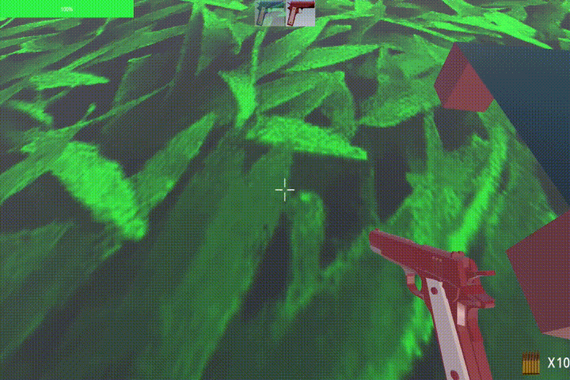

# Godot FPS Prototype
I created this project for the sake of learning.
There are probably much better FPS templates for Godot out there, and I would definitely do things differently if I had started this project over from scratch.

Below is a list of features in this prototype, along with a brief explanation of each feature.

## Movement

#### Crouching
This is pretty self explanatory, but pressing and holding `CTRL` on the keyboard will make the player crouch.

#### Head bobbing
Maybe there is a better term for this feature, but when you move in a direction the camera will slightly move up and down to simulate a "head bob" you get when you walk.

#### Sprinting
When holding down `shift` on the keyboard the player will sprint.
While the player is sprinting, their speed is increased and a stamina bar appears.
The stamina bar goes down as the player is sprinting.
When the stamina bar is empty, the player can no longer sprint and the stamina bar will begin to recharge.

#### Jumping
Another pretty self explanatory feature is when you press `spacebar` on the keyboard, the player will jump.

## Items

#### Picking Up Weapons
When you get close to a weapon and you hover the crosshair over the weapon, you will be presented with some text to press `E` on the keyboard to pickup the weapon.
When you pickup a weapon, it will be displayed in the weapon selection section at the top of the screen.

#### Switching Between Weapons
When you press `1` or `2` on the keyboard you can switch between the weapons in your current inventory.
Alternatively, you can use the scroll wheel on your mouse to switch between them.

#### Dropping Weapons
When you press `G` on the keyboard you will drop your currently equipped weapon on the ground.

#### Picking Up Dropped Weapons
When you pickup a weapon that was dropped on the ground, the ammo count will be the same as it was when you dropped it.
To give a better explanation, when you first pickup a weapon from the table it will have an ammo count of 10.
The animated demo below shows the player drop a weapon with an ammo count of 18.
Then the player picks up a new weapon from the table with an ammo count of 10.
Then the player picks back up the weapon on the ground (which had an ammo count of 18).
This results in a new ammo count of 28.

## Combat

#### Shooting An Enemy
When you shoot an enemy the player's crosshair will be slightly modified to let you know that the shot has made contact.

#### Enemy Pursuit
When you get within a certain range of the enemy, they will begin to pursuit you.

#### Enemy Dealing Damage
When you allow an enemy to get too close to you, they will begin to do damage to you.
When damage is taken, the health bar will go down and the screen will momentarily become Red.

## Menus

#### Pause Menu
Menus are not very exciting, but they are necessary in games.
When you press `Esc` on the keyboard the pause menu will come up and the game will enter a paused state.
The pause menu will allow you to resume the game, restart the game, exit the game, or adjust the mouse sensitivity in the settings.

#### Death Menu
When your health reaches 0% you have died.
The death menu allows you to restart or quit the game.

## Improvements
If I were going to continue improving on this project, here are a few things I might do.

1. I would make landing a shot on an enemy spawn a blood splatter graphic, then if the shot landed on any other surface I would make it spawn a bullet hole.

2. I would add more animations. For example, if the player started sprinting I would lower the weapon.

3. I would add magazines to the weapons along with a reload mechanic.

4. I would have the enemies in a separate room with a door. Then I would add a button I had to press by pressing `E` on the keyboard to open the door.

5. I would add a second type of enemy that has a ranged weapon and can deal damage to the player if the player is within a certain range.

6. I would add more options to the settings menu. Perhaps adjusting separate audio levels for the background sounds and sound effects. I would also add a slider to adjust the player's field of vision.

7. I would smooth out the crouching by using an animation.

## Final thoughts
As stated before, this project was just for me to further my learning of the Godot game engine. Feel free to clone this repo and use the code however you would like. This project was created with the open source [Godot](https://godotengine.org/) game engine, version 4.2.1. I look forward to furthering my learning of this game engine, and would definitely recommend learning it to others.